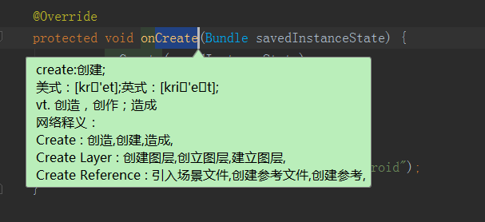
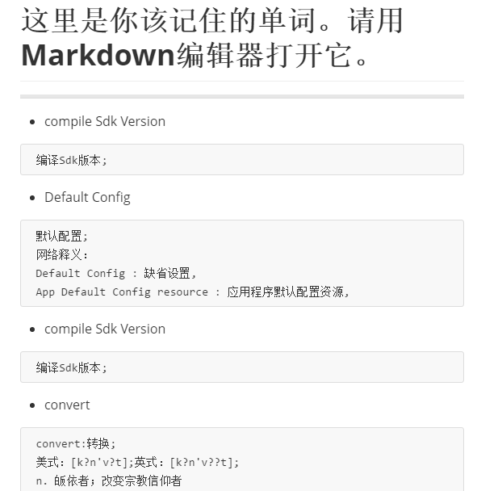

# ReciteWords

 是一个idea、AndroidStudio 记单词翻译插件,可以将英文翻译为中文并**记录到生词本**提供查阅。

## 功能
- 划词翻译
- 生词本保存翻译过后的历史记录

## 支持使用
 idea、AndroidStudio

## 环境
 Windows、Mac、Linux

## 使用方法

- Clone项目，获取根目录下的ReciteWords.jar。

- 打开Android Studio， Preferences -> Plugins -> Install plugin from disk -> 获取ReciteWords.jar安装并重启Android Studio。

- 选中代码，按下 Ctrl + Alt+Q(也可以自己设定)。即可翻译。效果如下:

- ~~你所翻译的单词会被记录在你**当前用户目录**下的ReciteWords.md文件中（如:C:\Users\Bolex\ReciteWords.md）。可以通过Markdown编辑器打开它进行学习。效果如下:~~

- 1.2版本更新后，将改为跟随项目路径生成单词历史记录。as翻译后切换Project模式可以在项目文件夹中直接看到。
  

## 修改快捷键

### 使用键盘快捷键触发
- Preferences -> Keymap -> 获取ReciteWords - > 右键 add Keyboard Shortcut. 输入你想要的快捷键即可。

# 版本
- 0.1 发布第一个版本 包含 划词翻译 和历史翻译记录成md文件
- 0.2 修复因为在androidStudio2.3版本中禁止了包名为空所抛出的异常。 感谢简书钟子明同学的测试！
- 1.1 修复因为没有权限写入导致翻译时抛出权限不足的异常。

- 1.2
   修复mac/linux平台下无权访问路径的问题
   替换用户目录保存历史为项目目录
   修复乱码异常，强制UTF-8编码
   

## Q
-  ~~MAC和Linux平台由于没有写入权限暂时不能保存MD文件。~~ 如果有大大知道java写入权限的问题 发个issues或者pull requsts过来。（已解决，见1.2提交日志。）

## Thanks
- [有道翻译](http://fanyi.youdao.com/openapi?path=data-mode)
- [ECTranslation](https://github.com/Skykai521/ECTranslation)
- 该插件是基于ECTranslation扩展的。在原有的基础上添加单词保存的功能，方便后续将陌生单词记录下来学习，已得到Skykai521的许可。

+MIT License
+
+Copyright (c) 2017 bolex-香脆的大鸡排
+
+Permission is hereby granted, free of charge, to any person obtaining a copy
+of this software and associated documentation files (the "Software"), to deal
+in the Software without restriction, including without limitation the rights
+to use, copy, modify, merge, publish, distribute, sublicense, and/or sell
+copies of the Software, and to permit persons to whom the Software is
+furnished to do so, subject to the following conditions:
+
+The above copyright notice and this permission notice shall be included in all
+copies or substantial portions of the Software.
+
+THE SOFTWARE IS PROVIDED "AS IS", WITHOUT WARRANTY OF ANY KIND, EXPRESS OR
+IMPLIED, INCLUDING BUT NOT LIMITED TO THE WARRANTIES OF MERCHANTABILITY,
+FITNESS FOR A PARTICULAR PURPOSE AND NONINFRINGEMENT. IN NO EVENT SHALL THE
+AUTHORS OR COPYRIGHT HOLDERS BE LIABLE FOR ANY CLAIM, DAMAGES OR OTHER
+LIABILITY, WHETHER IN AN ACTION OF CONTRACT, TORT OR OTHERWISE, ARISING FROM,
+OUT OF OR IN CONNECTION WITH THE SOFTWARE OR THE USE OR OTHER DEALINGS IN THE
+SOFTWARE.
